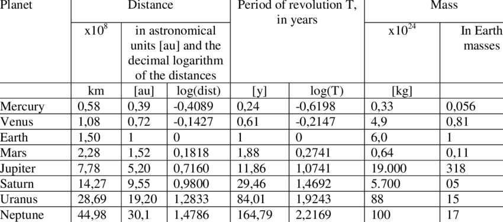

# Introdução a Criação de Páginas Web
## Exercícios da Aula 1
### Prof. Alexandre Meslin

Nos exercícios a seguir, teste cada página criada mas não se esqueça de validá-las usando o [W3C Markup Validator Service](https://validator.w3.org/).

1. Na páginas de recordes do jogo Whac-A-Mole, temos os nomes e pontuação dos grandes vencedores. Inclua uma nova coluna com as fotos dos jogadores no tamanho 30x40 pixels (largura e altura). 
[[Sugestão de solução](soluções/solução1.html)]

1. No nosso site de notícias, nós colocamos ícones para as redes sociais, mas não incluímos links. Modifique o arquivo HTML para que cada ícone desvie para a rede social correspondente. 
[[Sugestão de solução](soluções/solução2.html)]

1. No jogo Whac-A-Mole, temos links para ir para a próxima página e para a página anterior, mas não temos um menu de navegação que permita ir para qualquer página do jogo diretamente. Modifique as páginas do jogo para incluir um menu de navegação com links para todas as páginas. 
[[Sugestão de solução](soluções/solução3.html)]

1. Crie uma página HTML para mostrar dados sobre os planetas do nosso sistema solar. 
Exiba os dados em formato de uma tabela semelhante a da figura a seguir ([Micescu, Nicolae & Barna, Emil & Mircea, Victor & Rusu, Mircea. A NEW E-LEARNING CURRICULUM FOR HIGH SCHOOL PHYSICS.](https://www.researchgate.net/publication/268419560_A_NEW_E-LEARNING_CURRICULUM_FOR_HIGH_SCHOOL_PHYSICS)).
A tabela original está no seguinte [link](https://www.researchgate.net/figure/The-relevant-data-on-the-planets-from-our-Solar-system_tbl2_268419560). Inclua na página um título, algum texto e um link para a fonte original da tabela.
[[Sugestão de solução](soluções/solução4.html)]
  

   
